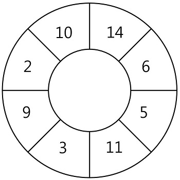

# 모의테스트 해설강의

2020-06-05 ~ 2020-06-08 (4Days)

링크: [https://programmers.co.kr/learn/courses/18](https://programmers.co.kr/learn/courses/18)


### 파트1. 자릿수 더하기 문제 [Link](https://programmers.co.kr/learn/courses/18/lessons/1876)

- 문제

    자연수 N이 주어지면, N의 각 자릿수의 합을 구해서 return 하는 solution 함수를 만들어 주세요.

    예를들어 N = 123이면 1 + 2 + 3 = 6을 return 하면 됩니다.

- 풀이

    1. 각 자리수의 숫자를 글자로 만든다.
    2. 글자로 만든 것을 리스트로 만든다.
    3. 리스트의 글자들을 숫자로 바꾼뒤 더한다.

    ``` python
    def solution(n):
        answer = sum(map(int, list(str(n))))

        return answer
    ```

    1. 숫자는 10진법으로 되어있기 때문에 각 자릿수의 값을 구하면 된다.
    2. 숫자를 10으로 나눈 나머지를 정답에 더하고 몫을 다시 숫자에 넣는다.
    3. 숫자가 0보다 클 때 까지 반복한다.
    ``` python
    def solution(n):
        answer = 0
        while n > 0:
            answer += n % 10
            n //= 10
        return answer
    ```

### 파트2. 순열 검사 문제 [Link](https://programmers.co.kr/learn/courses/18/lessons/1877)

- 문제

    길이가 n인 배열에 1부터 n까지 숫자가 중복 없이 한 번씩 들어 있는지를 확인하려고 합니다.

    1부터 n까지 숫자가 중복 없이 한 번씩 들어 있는 경우 true를, 아닌 경우 false를 반환하도록 함수 solution을 완성해주세요.

- 풀이

    1. 체크 리스트를 만든다.
    2. 배열에 숫자를 하나씩 꺼내서 체크리스트의 칸에 True로 바꾼다.
    3. 단, 꺼낸 숫자가 체크리스트의 길이보다 크면 False를 리턴한다.
    4. 또는 꺼낸 숫자가 이미 체크리스트에 True로 있으면 False를 리턴한다.
    5. True를 리턴한다.
    ``` python
    def solution(arr):

        check = [False] * (len(arr)+1)

        for i in arr:
            if i > len(arr) or check[i]:
                return False
            check[i] = True

        return True
    ```

    1. 배열을 정렬한다.
    2. 정렬한 배열과 1부터 n까지 배열을 하나씩 꺼내 비교한다.
    3. 비교한 부분이 다르면 False를 리턴한다.
    4. 아니면 True를 리턴한다.

    ``` python
    def solution(arr):
        arr.sort()
        
        for i, j in zip(arr, [i for i in range(1, len(arr)+1)]):
            if i != j:
                return False

        return True
    ```

    1. 배열을 정렬한다.
    2. 정렬한 배열에 값을 하나씩 꺼내 1부터 순서대로 있는지 확인한다.
    3. 순서대로 없을 때 False로 리턴한다.
    4. 끝까지 탐색하여 성공하면 True를 리턴한다.
    ``` python
    def solution(arr):
        arr.sort()
        
        for i in range(len(arr)):
            if arr[i] != i+1:
                return False

        return True
    ```

### 파트3. 나머지 한 점 문제 [Link](https://programmers.co.kr/learn/courses/18/lessons/1878)

- 문제

    직사각형을 만드는 데 필요한 4개의 점 중 3개의 좌표가 주어질 때, 나머지 한 점의 좌표를 구하려고 합니다.
    
    점 3개의 좌표가 들어있는 배열 v가 매개변수로 주어질 때, 직사각형을 만드는 데 필요한 나머지 한 점의 좌표를 return 하도록 solution 함수를 완성해주세요.
    
    단, 직사각형의 각 변은 x축, y축에 평행하며, 반드시 직사각형을 만들 수 있는 경우만 입력으로 주어집니다.

- 풀이

    조건문을 이용한 풀이

    ``` python
    def solution(v):
    answer = v[0]

    if v[0][0] == v[1][0]:
        answer[0] = v[2][0]

    elif v[0][0] == v[2][0]:
        answer[0] = v[1][0]

    if v[0][1] == v[1][1]:
        answer[1] = v[2][1]

    elif v[0][1] == v[2][1]:
        answer[1] = v[1][1]

    return answer
    ```

    XOR 원리를 이용한 풀이
    
    ``` python
    def solution(v):
    x2 = v[0][0] ^ v[1][0] ^ v[2][0]
    y2 = v[0][1] ^ v[1][1] ^ v[2][1]
    return [x2, y2]
    ```

### 파트4. 가장 큰 정사각형 찾기 문제 [Link](https://programmers.co.kr/learn/courses/18/lessons/1879)

- 문제

    1와 0로 채워진 표(board)가 있습니다. 표 1칸은 1 x 1 의 정사각형으로 이루어져 있습니다.
    
    표에서 1로 이루어진 가장 큰 정사각형을 찾아 넓이를 return 하는 solution 함수를 완성해 주세요.(단, 정사각형이란 축에 평행한 정사각형을 말합니다.)

    예를 들어 다음과 같은 표가 있다면, 가장 큰 정사각형의 넓이는 9가 되므로 9를 반환해 주면 됩니다.

    | 1 | 2 | 3 | 4 |
    |:-:|:-:|:-:|:-:|
    | 0 | 1 | 1 | 1 |
    | 1 | 1 | 1 | 1 |
    | 1 | 1 | 1 | 1 |
    | 0 | 0 | 1 | 0 |

- 풀이

    1. 1 by x 이거나, y by 1이면 0 또는 1이다.
    2. 2 by 2 이상인 사각형들에 대해서는 (1, 1)부터 탐색을 시작한다.
    3. (1, 1)에 들어갈 최대 변의 길이는 (0, 0), (0, 1), (1, 0) 의 최솟값이다.
    4. 탐색을 모두 한 뒤 answer의 값의 제곱을 한다.

    ``` python
    def solution(board):
        answer = 0
        if len(board) == 1:  # 1 by x 인 board
            return max(board[0])
        elif len(board[0]) == 1:  # y by 1 인 board
            for i in board:
                for j in i:
                    if j == 1:
                        return 1
            return 0 

        # 2by2 이상인 사각형들
        for i in range(1, len(board)):
            for j in range(1, len(board[i])):
                if board[i][j] == 0:
                    continue
                else:
                    board[i][j] = min(board[i][j-1], board[i-1][j], board[i-1][j-1]) + 1
                    if answer < board[i][j]:
                        answer = board[i][j]

        return answer ** 2
    ```


### 파트5. 땅따먹기 문제 [Link](https://programmers.co.kr/learn/courses/18/lessons/1880)

- 문제

    땅따먹기 게임을 하려고 합니다.
    
    땅따먹기 게임의 땅(land)은 총 N행 4열로 이루어져 있고, 모든 칸에는 점수가 쓰여 있습니다.
    
    1행부터 땅을 밟으며 한 행씩 내려올 때, 각 행의 4칸 중 한 칸만 밟으면서 내려와야 합니다.
    
    단, 땅따먹기 게임에는 한 행씩 내려올 때, 같은 열을 연속해서 밟을 수 없는 특수 규칙이 있습니다.

- 풀이

    ``` python
    def solution(land):
        land.insert(0, [0, 0, 0, 0])

        for i in range(1, len(land)):
            for j in range(4):
                first, second, third = [i for i in range(4) if i != j]      
                land[i][j] += max(land[i-1][first], land[i-1][second], land[i-1][third])

        answer = max(land[len(land)-1])
        return answer
    ```
 
    1. 결국 가장 중요한 것은 마지막 줄이다. 마지막 줄을 계속 갱신해 나가면 정답을 출력할 수 있다.
    2. 먼저 마지막 줄을 [0] * 4 로 만든다.
    3. 한 줄씩 읽어와 마지막 줄과 읽어온 줄을 비교하며 계산한다. 비교 방법은 다음과 같다.
    4. 마지막 줄에 들어갈 숫자는 자기자신 + 이전 자신의 위를 제외한 숫자들의 최댓값이다.
    ``` python
    def solution2(land):
        sum_list = [0]*4
        
        for row in land:
            tmp = sum_list.copy()
            for i in range(4):
                sum_list[i] = row[i] + max(tmp[:i] + tmp[i+1:])

        return max(sum_list)
    ```

    왼쪽과 윗쪽을 0으로 패딩한 후 계산하는 방법

    ``` python
    def solution(board):
        max = 0

        result = [[0 for col in range(len(board[0]) + 1)] for row in range(len(board) + 1)]
        for i in range(len(board)): 
            for j in range(len(board[0])):
                if board[i][j] == 1: 
                    result[i+1][j+1] = min(result[i][j+1], result[i][j], result[i+1][j]) + 1
                    if max < result[i+1][j+1]: 
                        max = result[i+1][j+1]
        return max ** 2
    ```

### 파트6. 스티커 모으기 문제 [Link](https://programmers.co.kr/learn/courses/18/lessons/1881)

- 문제

    N개의 스티커가 원형으로 연결되어 있습니다. 다음 그림은 N = 8인 경우의 예시입니다.

    

    원형으로 연결된 스티커에서 몇 장의 스티커를 뜯어내어 뜯어낸 스티커에 적힌 숫자의 합이 최대가 되도록 하고 싶습니다.
    
    단 스티커 한 장을 뜯어내면 양쪽으로 인접해있는 스티커는 찢어져서 사용할 수 없게 됩니다.

    예를 들어 위 그림에서 14가 적힌 스티커를 뜯으면 인접해있는 10, 6이 적힌 스티커는 사용할 수 없습니다.
    
    스티커에 적힌 숫자가 배열 형태로 주어질 때, 스티커를 뜯어내어 얻을 수 있는 숫자의 합의 최댓값을 return 하는 solution 함수를 완성해 주세요.
    
    원형의 스티커 모양을 위해 배열의 첫 번째 원소와 마지막 원소가 서로 연결되어 있다고 간주합니다.

- 풀이

    ``` python
    def solution(sticker):

        if len(sticker) <= 3:
            return max(sticker)

        # 첫 스티커 뜯은 경우
        dp = sticker.copy()
        dp[1] = dp[0]
        dp.pop()  # 마지막 스티커는 못뜯어서 빼버림
        for i in range(2, len(dp)):
            dp[i] = max(dp[i] + dp[i-2], dp[i-1])

        # 첫 스티커 뜯지 않은 경우
        dp2 = sticker.copy()
        dp2[0] = 0
        for i in range(2, len(dp2)):
            dp2[i] = max(dp2[i] + dp2[i-2], dp2[i-1])

        return max(dp[len(dp)-1], dp2[len(dp2)-1])
    ```

    cashe 사용하여 풀기

    ``` python
    def solution(sticker):
        n = len(sticker)
        if n <= 3:
            return max(sticker)
        
        # select node 0
        cashe1 = [sticker[0], sticker[0]]
        for i in range(2, n-1):
            cashe1_0th = cashe1[1]
            cashe1_1st = max(cashe1[1], cashe1[0]+sticker[i])
            cashe1 = [cashe1_0th, cashe1_1st]
        
        # select node 1
        cashe2 = [0, sticker[1]]
        for i in range(2, n):
            cashe2_0th = cashe2[1]
            cashe2_1st = max(cashe2[1], cashe2[0]+sticker[i])
            cashe2 = [cashe2_0th, cashe2_1st]

        return max(max(cashe1), max(cashe2))
    ```

### 파트7. 단어 퍼즐 문제 [Link](https://programmers.co.kr/learn/courses/18/lessons/1882)

- 문제

    단어 퍼즐은 주어진 단어 조각들을 이용해서 주어진 문장을 완성하는 퍼즐입니다.
    
    이때, 주어진 각 단어 조각들은 각각 무한개씩 있다고 가정합니다.
    
    예를 들어 주어진 단어 조각이 [“ba”, “na”, “n”, “a”]인 경우 ba, na, n, a 단어 조각이 각각 무한개씩 있습니다.
    
    이때, 만들어야 하는 문장이 “banana”라면 “ba”, “na”, “n”, “a”의 4개를 사용하여 문장을 완성할 수 있지만, “ba”, “na”, “na”의 3개만을 사용해도 “banana”를 완성할 수 있습니다.
    
    사용 가능한 단어 조각들을 담고 있는 배열 strs와 완성해야 하는 문자열 t가 매개변수로 주어질 때, 주어진 문장을 완성하기 위해 사용해야 하는 단어조각 개수의 최솟값을 return 하도록 solution 함수를 완성해 주세요.
    
    만약 주어진 문장을 완성하는 것이 불가능하면 -1을 return 하세요.

- 풀이

    ``` python
    def solution(strs, t):
        INF = int(1e9)
        n = len(t)
        dp = [0] * (n+1)

        for i in range(1, n+1):
            dp[i] = INF
            for k in range(1, 6):
                if i < k:
                    s = 0
                else:
                    s = i - k
                if t[s:i] in strs:
                    dp[i] = min(dp[i], dp[i-k] + 1)

        answer = dp[-1] if dp[-1] != INF else -1
        return answer
    ```
