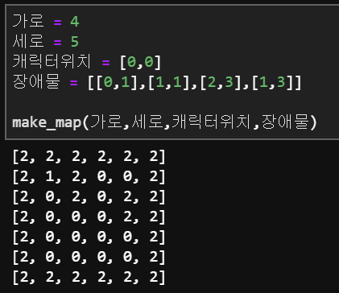

# [문제88 : 지식이의 게임개발](https://www.notion.so/88-97e611445cd64c97814185951c0c4259)

지식이는 게임을 만드는 것을 좋아합니다. 하지만 매번 다른 크기의 지도와 장애물을 배치하는데 불편함을 겪고있습니다. 이런 불편함을 해결하기 위해 지도의 크기와 장애물의 위치, 캐릭터의 위치만 입력하면 게임 지형을 완성해주는 프로그램을 만들고 싶습니다.  지식이를 위해 게임 지형을 만드는 프로그램을 작성해 주세요

가로:n /세로:m 크기가 주어집니다.

지형의 테두리는 벽으로 이루어져 있습니다.

캐릭터가 있는 좌표가 배열형태로 주어집니다.

장애물이 있는 좌표가 2차원 배열 형태로 주어집니다.

지도는 n x m 크기의 배열이며 배열안의 값은

    움직일수 있는 공간(0)
    캐릭터(1)
    벽(2)

3개로 구분되어 있습니다.

입출력 예시)



# 풀이88-1

``` python
def make_map(row, column, locate_c, obstacle):
    # 메모리 확보
    matrix = [[0 for _ in range(row)] for _ in range(column)]

    for i in range(len(matrix)):
        for j in range(len(matrix[i])):
            if [i, j] in obstacle:
                matrix[i][j] = 2
            if [i, j] == locate_c:
                matrix[i][j] = 1

    result = padding(matrix, row, column)
    return result


def padding(matrix, row, column):
    # 메모리 확보
    padding_matrix = [[0 for _ in range(row+2)] for _ in range(column+2)]

    for i in range(column+2):
        for j in range(row+2):
            if i in (0, column+1) or j in (0, row+1):
                padding_matrix[i][j] = 2
            else:
                padding_matrix[i][j] = matrix[i-1][j-1]
    
    return padding_matrix

row = 4
column = 5
locate_c = [0, 0]
obstacle = [[0, 1], [1, 1], [2, 3], [1, 3]]

new_map = make_map(row, column, locate_c, obstacle)
for i in range(len(new_map)):
    print(new_map[i])
```

# 풀이88-2

답안

``` python
def make_map(n,m,char,obj):
    #지도 초기화하기
		#각 지도 가로/세로 두칸 외벽을 포함한 크기만큼 추가하기(각 끝 한칸씩)
    world_map = [[0]*(n+2) for i in range(m+2)]
    #지도 외벽 그리기
    for i in range(len(world_map)):
        for j in range(len(world_map[0])):
            if i==0 or j==len(world_map[0])-1 or j==0 or i ==len(world_map)-1:
                world_map[i][j]=2
#     print(wordl_map)
    #지도에 캐릭터 추가하기/ 외벽으로 인해 좌표에 +1을 해줍니다.
    world_map[char[0]+1][char[1]+1] = 1
    #지도에 장애물 추가하기
    for i in obj:
#         print(i)
        #장애물을 추가하려는 자리에 캐릭터가 있을 시 캐릭터는 그대로둔다
				# 마찬가지 외벽으로 인한 좌표 조정을 해준다.
        world_map[i[0]+1][i[1]+1] = 2 if world_map[i[0]+1][i[1]+1] != 1 else 1
    for i in world_map:
        print(i)
```