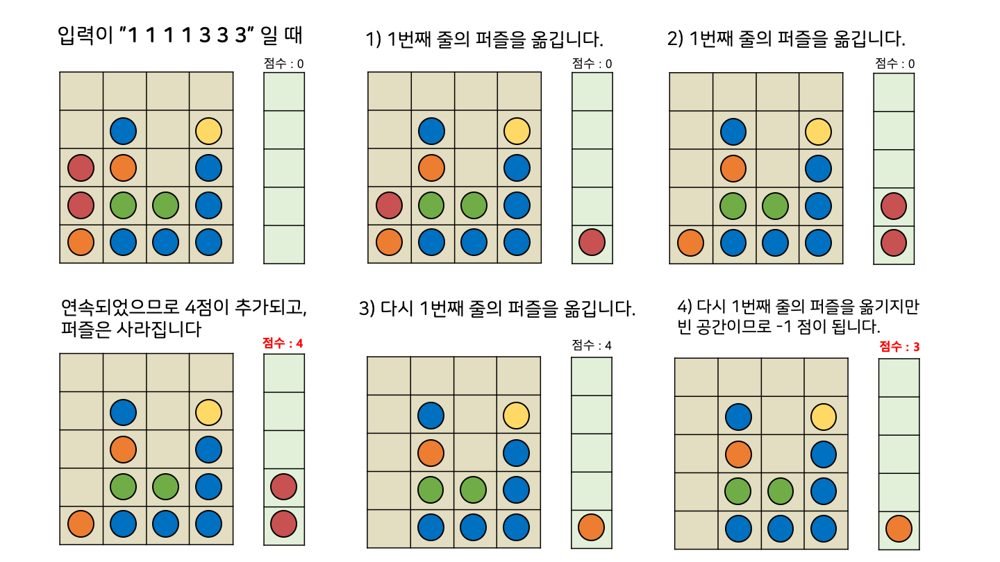
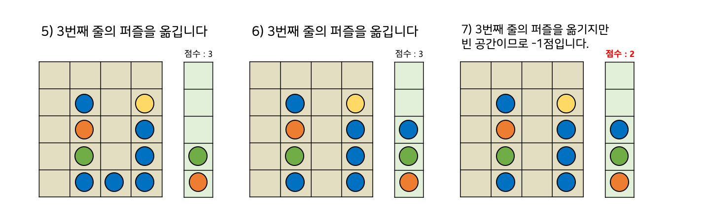

# [문제100 : 퍼즐게임](https://www.notion.so/100-d0ee0ea183324aa8906e610161723c79)

N x M으로 이루어진 아래와 같은 공간에 퍼즐이 쌓여져 있습니다.
 
퍼즐을 맞추기 위해서는 반드시 맨 오른쪽 줄로 이동시켜 줘야 합니다.

만약 종류가 같은 퍼즐이 연속될 시에 점수가 추가되며 그 퍼즐은 사라집니다.

점수는 다음과 같습니다.

- 파란색 공 : 1점
- 빨간색 공 : 2점
- 노란색 공 : 3점
- 초록색 공 : 4점
- 주황색 공 : 5점

점수는 공의 개수만큼 추가됩니다.

예를 들어 빨간색 공이 2개 연속되어 없어졌을 경우 2*2 = 4점입니다.

게임 플레이어는 게임이 시작되면 어떤 퍼즐을 이동할 것인지 모두 작성합니다.

만약 비어있는 곳을 선택하게 된다면 점수가 1점 감소하며 그대로 진행합니다.

위 규칙에 맞는 점수를 리턴하는 함수를 작성하세요.


예를 들어 입력이 

    퍼즐 판 : [[0, 0, 0, 0], [0, 1, 0, 3], [2, 5, 0, 1], [2, 4, 4, 1], [5, 1, 1, 1]]
    조작 : [1, 1, 1, 1, 3, 3, 3] 

일 경우,





총 점수는 2점으로 2를 출력해야 합니다.

``` python
# 입력
퍼즐판 = [[0,0,0,0][0,1,0,3][2,5,0,1][2,4,4,1][5,1,1,1]]
조작 = [1,1,1,1,3,3,3]

# 출력
2
```

# 풀이100-1

``` python
def solution(board, moves):
    score = 0
    stack = []
    while moves:  # 이동에 있는 모든 것을 탐색한다.
        line = len(board)
        m = moves.pop(0)-1  # 이동을 하나 꺼낸다.
        for i in range(line):  # for 꺼낸 숫자의 라인을 위에서 부터 쭉 읽는다.
            cur = board[i][m]  # 커서(공 값)
            if cur == 0:  # 커서가 0이면 라인에 1값을 뺀다. 
                line -= 1  # 라인의 모든 숫자가 0이면 line은 0이된다.
            else:  # 0이 아닌값이 있으면
                if stack != [] and stack[-1] == cur:
                    stack.pop()
                    score += cur * 2
                else:
                    stack.append(cur)
                board[i][m] = 0  # 라인에 공값을 비워둔다.
                break  # 탐색 종료
        # 라인관리
        if line == 0:
            score -= 1

        print(stack)
        print(score)
    return score


board = [[0,0,0,0],[0,1,0,3],[2,5,0,1],[2,4,4,1],[5,1,1,1]]
moves = [1,1,1,1,3,3,3]

print(solution(board, moves))

```

# 풀이100-2

답안

``` python
def solution(plate, moves):
    stack=[0]
    point = 0
    while moves:
        m = moves.pop(0)
        for i in range(len(plate)):
            if plate[i][m-1]!=0:
                if stack[len(stack)-1] == plate[i][m-1]:
                    point+= plate[i][m-1]*2
                    plate[i][m-1] = 0
                    stack.pop()
                else:
                    stack.append(plate[i][m-1])
                plate[i][m-1] = 0
                break
            else:
                if  i==len(plate)-1 and plate[i][m-1]==0:
                    point-=1

    return point
```