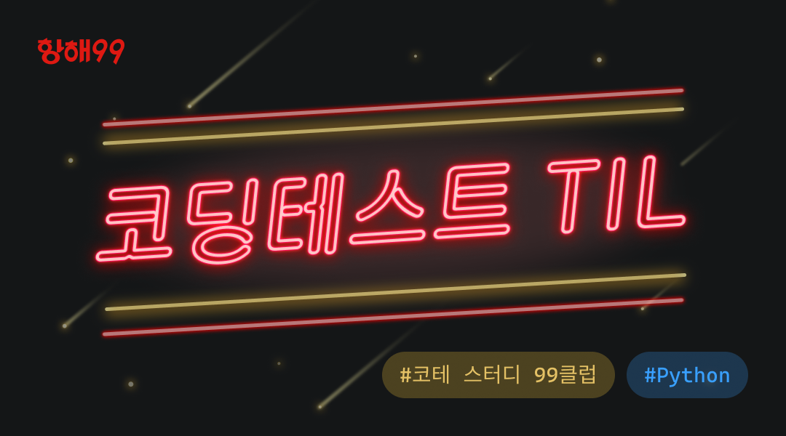

# 향해99 99클럽 코딩테스트 스터디 3기

- 기간: 2024-07-22 ~ 2024-09-02
- 수강: 99클럽 코딩테스트 스터디 3기(파이썬 / 챌린저)

```text
#99클럽 #코딩테스트준비 #개발자취업 #항해99 #TIL
▞▞ (✿◠‿◠) (っ◔◡◔)っ (๑◕‿◕๑) ᕦ(ò_óˇ)ᕤ ( ･ิᴥ･ิ) ⎝ᑒ⎠ ▚▚
```



## 문제 풀이

### 99클럽 코테 스터디 18일차 TIL

- [[비기너 Day 18] Increasing Order Search Tree](../Leetcode/problems/897.%20Increasing%20Order%20Search%20Tree.md)
- [[미들러 Day 18] 단지 번호 붙이](../BAEKJOON/problems/2667.md)
- [[챌린저 Day 18] 일루미네이션](../BAEKJOON/problems/5547.md)

### 99클럽 코테 스터디 17일차 TIL

- [[비기너 Day 17] Binary Tree Inorder Traversal](../Leetcode/problems/)
- [[미들러 Day 17] 촌수 계산](../BAEKJOON/problems/2644.md)
- [[챌린저 Day 17] 사자와 토끼](../BAEKJOON/problems/17834.md)

### 99클럽 코테 스터디 16일차 TIL

TODO: 비기너, 미들러, 챌린저(다시풀기)

- [[비기너 Day 16] 최소 직사각형](../Programmers/Python/Code/최소직사각형.py)
- [[미들러 Day 16] 모음 사전](../Programmers/Python/Code/모음%20사전.py)
- [[챌린저 Day 16] N-Queen](../Programmers/Python/Code/N-Queen.py)

### 99클럽 코테 스터디 15일차 TIL

TODO: 미들러

- [[비기너 Day 15] 모의고사](../Programmers/Python/Code/모의고사.py)
- [[미들러 Day 15] Prefix and Suffix Search](../Leetcode/problems/745.%20Prefix%20and%20Suffix%20Search.md)
- [[챌린저 Day 15] 소수찾기](../Programmers/Python/Code/소수%20찾기2.py)

### 99클럽 코테 스터디 14일차 TIL

TODO: 비기너

- [[비기너 Day 14] Symmetric Tree](../Leetcode/problems/101.%20Symmetric%20Tree.md)
- [[미들러 Day 14] 숫자 카드2](../BAEKJOON/problems/10816.md)
- [[챌린저 Day 14] 징검다리](../Programmers/Python/Code/징검다리.py)

### 99클럽 코테 스터디 13일차 TIL

- [[비기너 Day 13] Search in a Binary Search Tree](../Leetcode/problems/700.%20Search%20in%20a%20Binary%20Search%20Tree.md)
- [[미들러 Day 13] 숫자 카드](../BAEKJOON/problems/10815.md)
- [[챌린저 Day 13] 입국 심사](../Programmers/Python/Code/입국심사.py)

### 99클럽 코테 스터디 12일차 TIL

- [[비기너 Day 12] 문자열 내림차순으로 배치하기](../Programmers/Python/Code/문자열%20내림차순으로%20배치하기.py)
- [[미들러 Day 12] H-Index](../Programmers/Python/Code/H-Index.py)
- [[챌린저 Day 12] 뉴스 전하기](../BAEKJOON/problems/1135.md)
  - Keywords: tree, DFS, graph search
  - How to think: using count, DFS, graph search
  - How to do it: accumulates the time while traversing the tree using DFS
  - New realization: DP On Trees

### 99클럽 코테 스터디 11일차 TIL

- [[비기너 Day 11] 정수 내림차순으로 배치하기](../Programmers/Python/Code/정수%20내림차순으로%20배치하기.py)
- [[미들러 Day 11] 카드 뭉치](../Programmers/Python/Code/카드%20뭉치.py)
- [[챌린저 Day 11] 가장 큰 수](../Programmers/Python/Code/가장%20큰%20수.py)
  - Keywords: sorting
  - How to think: using sort with some logic
  - How to do it: repeatedly sort by digit count three times
  - New realization: sort by digit count

### 99클럽 코테 스터디 10일차 TIL

- [[비기너 Day 10] Kth Largest Element in a Stream](../Leetcode/problems/703.%20Kth%20Largest%20Element%20in%20a%20Stream.md)
- [[미들러 Day 10] 이중 우선순위 큐](../Programmers/Python/Code/이중우선순위큐.py)
- [[챌린저 Day 10] 최대 힙](../BAEKJOON/problems/11279.md)
  - Keywords: heap
  - How to think: Use a min heap with minus
  - How to do it: implement a max heap by using a min heap with minus
  - New realization: Nothing new

### 99클럽 코테 스터디 9일차 TIL

- [[비기너 Day 9] Relative Ranks](../Leetcode/problems/506.%20Relative%20Ranks.md)
- [[미들러 Day 9] 더 맵게](../Programmers/Python/Code/더%20맵게.py)
- [[챌린저 Day 9] 최소 힙](../BAEKJOON/problems/1927.md)
  - Keywords: heap
  - How to think: Use a min heap
  - How to do it: Just implement a heap(since heaps in Python are basically min heaps)
  - New realization: Nothing new

### 99클럽 코테 스터디 8일차 TIL

- [[비기너 Day 8] 올바른 괄호](../Programmers/Python/Code/올바른%20괄호.py)
- [[미들러 Day 8] 기능 개발](../Programmers/Python/Code/기능개발.py)
- [[챌린저 Day 8] 두 큐 합 같게 만들기](../Programmers/Python/Code/두%20큐%20합%20같게%20만들기.py)
  - Keywords: two pointer
  - How to think: If the sum is odd -> return -1. No need to use a queue, use two pointers instead. The termination condition can be tricky.
  - How to do it: Combine the queues into a single list. The termination condition is when both the start and end pointers reach the end of the list.
  - New realization: Implement the solution.

### 99클럽 코테 스터디 7일차 TIL

- [[비기너 Day 7] 같은 숫자는 싫어](../Programmers/Python/Code/같은%20숫자는%20싫어.py)
- [[미들러 Day 7] 하노이의 탑](../Programmers/Python/Code/하노이의%20탑.py)
- [[챌린저 Day 7] 과제 진행하기](../Programmers/Python/Code/과제%20진행하기.py)
  - Keywords: stack, sort, simulation
  - How to think: think step by step, use a stack
  - How to do it: process the data first, then apply the logic, time calculations take a long time
  - New realization: I need to think slowly and solve the problem carefully

### 99클럽 코테 스터디 6일차 TIL

- [[비기너 Day 6] 폰켓몬](../Programmers/Python/Code/폰켓몬.py)
- [[미들러 Day 6] 의상](../Programmers/Python/Code/의상.py)
- [[챌린저 Day 6] 테이블 해시 함수](../Programmers/Python/Code/테이블%20해시%20함수.py)
  - Keyword: sort, xor
  - Think What: test
  - Think How: sort first, then calculate
  - New Known: sort on a 2D list

### 99클럽 코테 스터디 5일차 TIL

- [[비기너 Day 5] 완주하지 못한 선수](../Programmers/Python/Code/완주하지%20못한%20선수.py)
- [[미들러 Day 5] 전화번호 목록](../Programmers/Python/Code/전화번호%20목록.py)
- [[챌린저 Day 5] 베스트 앨범](../Programmers/Python/Code/베스트앨범.py)
  - Keyword: hash
  - Think What:
  - Think How:
  - New Known: nothing new

### 99클럽 코테 스터디 4일차 TIL

- [[비기너 Day 4] 문자열을 정수로 바꾸기](../Programmers/Python/Code/문자열을%20정수로%20바꾸기.py)
- [[미들러 Day 4] JadenCase 문자열 만들기](../Programmers/Python/Code/JadenCase%20문자열%20만들기.py)
- [[챌린저 Day 4] 문자열 압축](../Programmers/Python/Code/문자열%20압축.py)
  - Keyword: string
  - Think What:
  - Think How:
  - New Known: nothing new

### 99클럽 코테 스터디 3일차 TIL

- [[비기너 Day 3] 문자열 내 p와 y의 개수](../Programmers/Python/Code/문자열%20내%20p와%20y의%20개수.py)
- [[미들러 Day 3] 문자열 내 마음대로 정렬하기](../Programmers/Python/Code/문자열%20내%20마음대로%20정렬하기.py)
- [[챌린저 Day 3] 숫자 문자열과 영단어](../Programmers/Python/Code/숫자%20문자열과%20영단어.py)
  - Keyword: string, hash, replace
  - Think What: Replace string
  - Think How: seperate data and functions
  - New Known: nothing new

### 99클럽 코테 스터디 2일차 TIL

- [[비기너 Day 2] 평균 구하기](../Programmers/Python/Code/평균%20구하기.py)
- [[미들러 Day 2] x만큼 간격이 있는 n 개의 숫자](../Programmers/Python/Code/x만큼%20간격이%20있는%20n개의%20숫자.py)
- [[챌린저 Day 2] 숫자 카드 나누기](../Programmers/Python/Code/숫자%20카드%20나누기.py)
  - Keyword: GCD, reduce(instand of for loop)
  - Think What: GCD, for loop
  - Think How: calculate the GCD using a for loop, return true or false based on the condition of the GCD, and extract the answer
  - New Known: the reduce function

### 99클럽 코테 스터디 1일차 TIL

- [[비기너 Day 1] 자연수 뒤집어 배열로 만들기](../Programmers/Python/Code/자연수%20뒤집어%20배열로%20만들기.py)
- [[미들러 Day 1] n^2 배열 자르기](../Programmers/Python/Code/n^2%20배열%20자르기.py)
- [[챌린저 Day 1] 뒤에 있는 큰 수 찾기](../Programmers/Python/Code/뒤에%20있는%20큰%20수%20찾기.py)
  - Keyword: stack
  - Think What: approach from back to front
  - Think How: stack the biggest number and implement logic
  - New Known: nothing new
