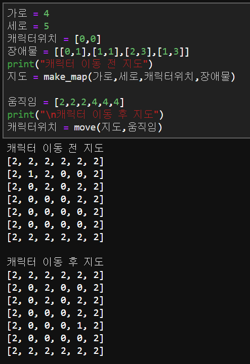

# [문제89 : 지식이의 게임개발2](https://www.notion.so/89-2-b63511ac8e644b47a72253b2139470d2)

(연계형 문제 - 88번을 먼저 풀고오셔야해요!)

제코베의 도움을 받아 성공적으로 지도를 만들어낸 지식이는 캐릭터의 움직임을 구현했습니다. 

하지만 지도위의 캐릭터위치를 나타내는데 문제가 발생했습니다.

지식이는 지도위에서 캐릭터의 위치를 나타내기위해 다시한번 제코베에 도움을 요청합니다.

지도위에서 캐릭터의 위치를 나타내주세요

1. 지도는 88번 문제의 해답을 사용해주세요
2. 입력값은 지도,캐릭터의 움직임입니다.
3. 캐릭터의 움직임은 {상:1,하:2,좌:3,우:4} 로 정수로 이루어진 배열이 들어갑니다.
4. 벽과 장애물은 통과할 수 없습니다. 
5. 마지막 캐릭터의 위치를 반영한 지도를 보여주고 위치를 반환하는함수를 작성해주세요.

입출력 예시-



# 풀이89-1

``` python
def move(matrix, movement):
    # 캐릭터가 어디있는지 찾고
    locate_c = []
    for i in range(len(matrix)):
        for j in range(len(matrix[i])):
            if 1 == matrix[i][j]:
                print([i, j], '에서 ', end='')
                locate_c.extend([i, j])
                matrix[i][j] = 0
                break
    # 맵에서 이동시킨다.
    # movement(up: 1, down: 2, left: 3, right: 4)
    for i in movement:
        if i == 1 and matrix[locate_c[0]-1][locate_c[1]] == 0:
            locate_c[0] -= 1
        elif i == 2 and matrix[locate_c[0]+1][locate_c[1]] == 0:
            locate_c[0] += 1
        elif i == 3 and matrix[locate_c[0]][locate_c[1]-1] == 0:
            locate_c[1] -= 1
        elif i == 4 and matrix[locate_c[0]][locate_c[1]+1] == 0:
            locate_c[1] += 1

    print(locate_c, '로 이동')
    matrix[locate_c[0]][locate_c[1]] = 1

    return matrix

# movement(up: 1, down: 2, left: 3, right: 4)
movement = [2, 2, 2, 4, 4, 4]
new_map2 = move(new_map, movement)

for i in range(len(new_map2)):
    print(new_map[i])
```

# 풀이89-2

해답

``` python
def move2(world_map, moving):
    x,y = 0,0
    for i,m in enumerate(world_map):
        if 1 in m:
            x,y = m.index(1),i
    world_map[y][x] = 0
    for i in moving:
        if i==1 and world_map[y-1][x]!=2:
            y-=1
            
        elif i==2 and world_map[y+1][x]!=2:
            y+=1
            
        elif i==3 and world_map[y][x-1]!=2:
            x-=1
            
        elif i==4 and world_map[y][x+1]!=2:
            x+=1
    world_map[y][x] = 1
    print('#' * 20)
    for i in world_map:
        print(i)
    return [x,y]

movement = [2, 2, 2, 4, 4, 4]
new_map2 = move2(new_map, movement)
```