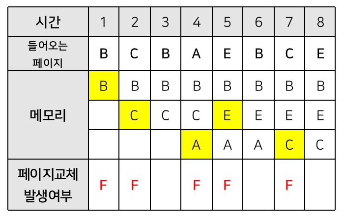

# [문제94 : 페이지 교체 - LRU 알고리즘](https://www.notion.so/94-LRU-140c248b729948b180398acc0a370a0e)

LRU 알고리즘이란 페이지 교체 알고리즘으로써, Least Resently Used의 약자입니다. 즉 페이지 부재가 발생했을 경우 가장 오랫동안 사용되지 않은 페이지를 제거하는 알고리즘입니다.

이 알고리즘의 기본 가설은 가장 오랫동안 이용되지 않은 페이지는 앞으로도 사용할 확률이 적다는 가정하에 페이지 교체가 진행됩니다.
다음 그림을 참고해주세요.

메모리의 크기가 i로 주어지고 들어올 페이지들이 n으로 주어졌을 때, 전체 실행시간을 구해주세요.

만약 스택 안에 같은 스케줄이 있다면 hit 이라고 하며 실행시간은 1초 입니다. 스택 안에 스케줄이 없다면 miss 라고 하며 실행시간은 6초 입니다.



메모리의 크기가 i로 주어지고 들어올 페이지들이 n으로 주어졌을 때, 전체 실행시간을 구해주세요.

만약 스택 안에 같은 스케줄이 있다면 hit 이라고 하며 실행시간은 1초 입니다. 스택 안에 스케줄이 없다면 miss 라고 하며 실행시간은 6초 입니다.

| Page       | Page frame | time |
| ---------- | ---------- | ---- |
| BCBAEBCE   | 3          | 33   |
| ABCABCABC  | 3          | 24   |
| ABCEDF     | 0          | 36   |

- 예제 1번을 보면 페이지 프레임의 개수는 3개이고 스케줄은 'BCBAEBCE' 입니다. 
  
  5번의 miss를 기록하므로 **5번 * 6초 = 30초**가 되고  3번의 hit을 기록하므로 **3번 * 1초 = 3초**입니다.
  
  2개를 합한 값이 실행시간이므로, 33초가 됩니다.

# 풀이94-1

``` python
page = 'BCBAEBCE'
frame = 3
time = 0

queue = []

for c in page:
    if c in queue:
        queue.remove(c)
        queue.append(c)
        time += 1
    else:
        if frame <= len(queue):
            queue.pop(0)
            queue.append(c)
        else:
            queue.append(c)
        time += 6

print(time)
```

# 풀이94-2

해답

``` python
def sol(frame, page):
    temp = []
    runTime = 0

    if frame == 0:
        runTime = len(page) * 6
        return runTime
    # cacheSize가 0일때, cities의 크기만큼 10을 곱해주고 끝낸다

    for i in page:
        if i in temp:
					  temp.append(temp.pop(0))
            runTime += 1
        else:
            if len(temp) < frame:
                temp.append(i)
                # temp가 비었으면 무조건 넣어야 하므로 if문을 사용함
            else:
                temp = temp[1:] + [i]
                # 가장 사용되지 않은 첫번째 배열을 제거하고 맨 뒤에 입력값을 저장해준다
            runTime += 6
            # if문 실행에 상관없이 runTime은 10이 추가된다
    return runTime
```