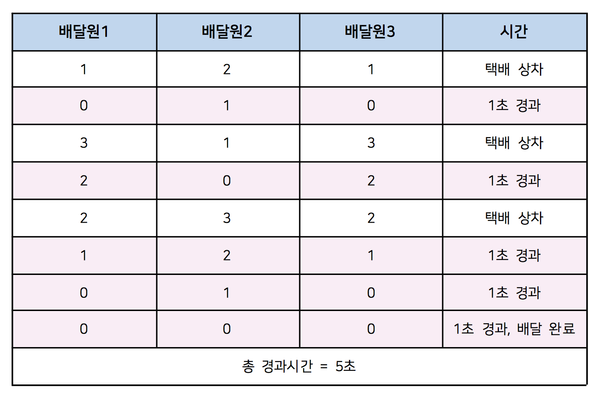

# [문제97 : 택배배달](https://www.notion.so/97-79d8a8c472ea4e3d842fb5f09805a971)

n명의 택배 배달원은 쌓인 택배를 배달해야 합니다.

각 택배는 접수된 순서로 배달이 되며 택배 마다 거리가 주어집니다. 

거리1당 1의 시간이 걸린다고 가정하였을 때 모든 택배가 배달 완료될 시간을 구하세요.

1. 모든 택배의 배송 시간 1 이상이며 배달지에 도착하고 돌아오는 왕복시간입니다.
2. 택배는 물류창고에서 출발합니다.
3. 배달을 완료하면 다시 물류창고로 돌아가 택배를 받습니다.
4. 물류창고로 돌아가 택배를 받으면 배달을 시작합니다.
5. 택배를 상차 할 때 시간은 걸리지 않습니다.

입력은 배달원의 수와 택배를 배달하는 배달 시간이 주어집니다.

ex) 배달원이 3명이고 각 거리가 [1,2,1,3,3,3]인 순서로 들어오는 경우



``` python
def solution(n,l):
    
    <코드 작성>
    return result  

배달원 = 3
배달시간 = [1,2,1,3,3,3]

print(solution(배달원,배달시간))
# 출력값 = 5
```
# 풀이97-1

``` python
def solution(n,l):
    result = 0
    mylist = [0 for i in range(n)]
    while l:
        for i in range(len(mylist)):
            if mylist[i] == 0 and l:
                mylist[i] = l.pop(0)
        mylist = list(map(lambda x: x-1, mylist))
        result += 1
    result += max(mylist)

    return result


배달원 = 3
배달시간 = [1,2,1,3,3,3]

print(solution(배달원,배달시간))
# 출력값 = 5
```

# 풀이97-2

해답

``` python
def sol(n,l):
# n:택배원 수, l:택배들
    answer = 0
		#택배원 수 만큼의 배열 생성
    man = [0]*n
    #모든 택배가 상차 되었을 경우 종료
    while sum(l)!=0:
				#택배원 수 만큼 반복
        for j in range(len(man)):
						# 택배원이 배달하고있는 택배의 잔여거리가 0인경우(배송완료인경우) 택배상차
            if man[j] == 0 and l:
                man[j]+=l.pop(0)
				#택배원들 배송거리 -1 처리
        man = list(map(lambda x : x-1,man))
				# 1회 반복단 1의 시간증가
        answer+=1
		# 남은 택배 잔여거리중 가장 많은 시간이 남은 택배를 더해줌
    answer+=max(man)
    return answer
```